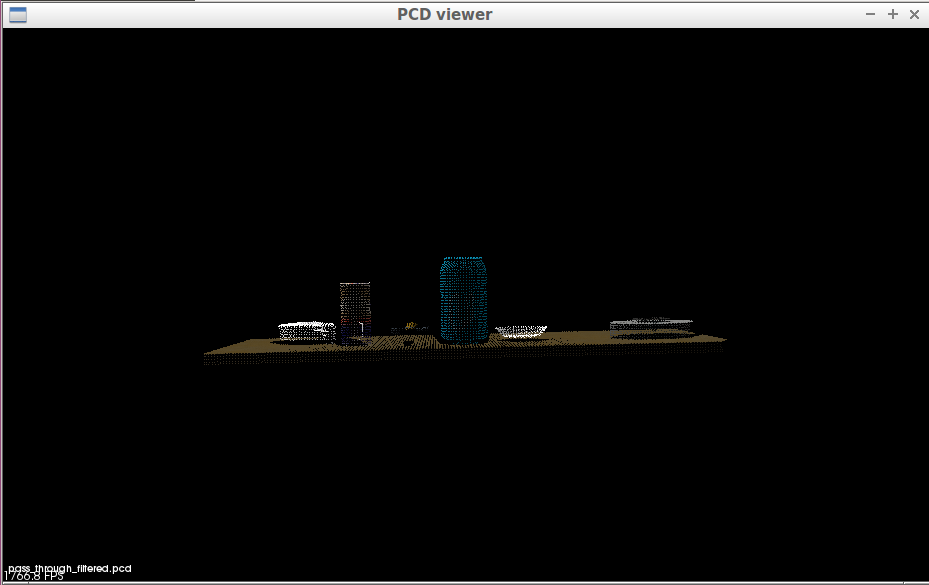
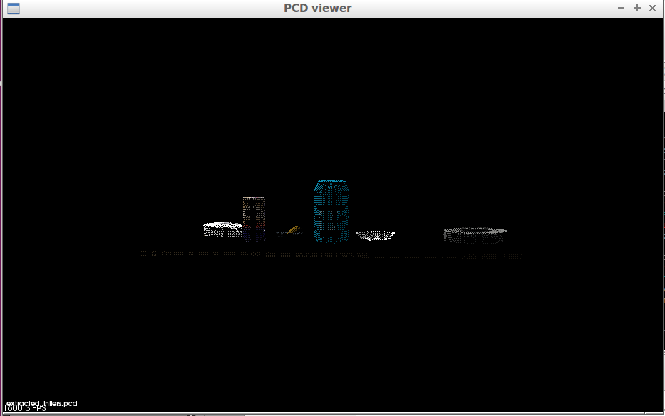
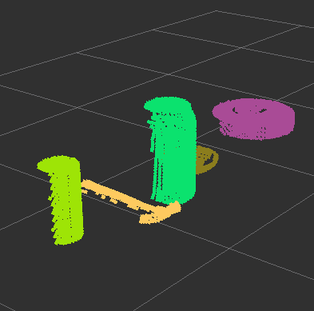

## Project: Perception Pick & Place
### Writeup Template: You can use this file as a template for your writeup if you want to submit it as a markdown file, but feel free to use some other method and submit a pdf if you prefer.

---


# Required Steps for a Passing Submission:
1. Extract features and train an SVM model on new objects (see `pick_list_*.yaml` in `/pr2_robot/config/` for the list of models you'll be trying to identify). 
2. Write a ROS node and subscribe to `/pr2/world/points` topic. This topic contains noisy point cloud data that you must work with.
3. Use filtering and RANSAC plane fitting to isolate the objects of interest from the rest of the scene.
4. Apply Euclidean clustering to create separate clusters for individual items.
5. Perform object recognition on these objects and assign them labels (markers in RViz).
6. Calculate the centroid (average in x, y and z) of the set of points belonging to that each object.
7. Create ROS messages containing the details of each object (name, pick_pose, etc.) and write these messages out to `.yaml` files, one for each of the 3 scenarios (`test1-3.world` in `/pr2_robot/worlds/`).  [See the example `output.yaml` for details on what the output should look like.](https://github.com/udacity/RoboND-Perception-Project/blob/master/pr2_robot/config/output.yaml)  
8. Submit a link to your GitHub repo for the project or the Python code for your perception pipeline and your output `.yaml` files (3 `.yaml` files, one for each test world).  You must have correctly identified 100% of objects from `pick_list_1.yaml` for `test1.world`, 80% of items from `pick_list_2.yaml` for `test2.world` and 75% of items from `pick_list_3.yaml` in `test3.world`.
9. Congratulations!  Your Done!

# Extra Challenges: Complete the Pick & Place
7. To create a collision map, publish a point cloud to the `/pr2/3d_map/points` topic and make sure you change the `point_cloud_topic` to `/pr2/3d_map/points` in `sensors.yaml` in the `/pr2_robot/config/` directory. This topic is read by Moveit!, which uses this point cloud input to generate a collision map, allowing the robot to plan its trajectory.  Keep in mind that later when you go to pick up an object, you must first remove it from this point cloud so it is removed from the collision map!
8. Rotate the robot to generate collision map of table sides. This can be accomplished by publishing joint angle value(in radians) to `/pr2/world_joint_controller/command`
9. Rotate the robot back to its original state.
10. Create a ROS Client for the “pick_place_routine” rosservice.  In the required steps above, you already created the messages you need to use this service. Checkout the [PickPlace.srv](https://github.com/udacity/RoboND-Perception-Project/tree/master/pr2_robot/srv) file to find out what arguments you must pass to this service.
11. If everything was done correctly, when you pass the appropriate messages to the `pick_place_routine` service, the selected arm will perform pick and place operation and display trajectory in the RViz window
12. Place all the objects from your pick list in their respective dropoff box and you have completed the challenge!
13. Looking for a bigger challenge?  Load up the `challenge.world` scenario and see if you can get your perception pipeline working there!

## [Rubric](https://review.udacity.com/#!/rubrics/1067/view) Points
### Here I will consider the rubric points individually and describe how I addressed each point in my implementation.  

---
### Writeup / README

#### 1. Provide a Writeup / README that includes all the rubric points and how you addressed each one.  You can submit your writeup as markdown or pdf.  


### Exercise 1, 2 and 3 pipeline implemented
#### 1. Complete Exercise 1 steps. Pipeline for filtering and RANSAC plane fitting implemented.
```python
# PassThrough filter
# Create a PassThrough filter object.
passthrough = cloud_filtered.make_passthrough_filter()

# Assign axis and range to the passthrough filter object.
filter_axis = 'z'
passthrough.set_filter_field_name(filter_axis)
axis_min = 0.6
axis_max = 1.1
passthrough.set_filter_limits(axis_min, axis_max)

# Finally use the filter function to obtain the resultant point cloud.
cloud_filtered = passthrough.filter()
```


```python
# RANSAC plane segmentation
# Create the segmentation object
seg = cloud_filtered.make_segmenter()

# Set the model you wish to fit
seg.set_model_type(pcl.SACMODEL_PLANE)
seg.set_method_type(pcl.SAC_RANSAC)

# Max distance for a point to be considered fitting the model
# Experiment with different values for max_distance
# for segmenting the table
max_distance = 0.01
seg.set_distance_threshold(max_distance)

# Call the segment function to obtain set of inliner indices and model coefficients
inliners, coefficients = seg.segment()


# Extract inliers
extracted_inliners = cloud_filtered.extract(inliners, negative=False)
```


#### 2. Complete Exercise 2 steps: Pipeline including clustering for segmentation implemented.  
```python
# Convert the object cloud to a white cloud and make Kd Tree.
white_cloud = XYZRGB_to_XYZ(cloud_objects)
tree = white_cloud.make_kdtree()

# Apply Euclidean Clustering.
ec = white_cloud.make_EuclideanClusterExtraction()
ec.set_ClusterTolerance(0.05)
ec.set_MinClusterSize(50)
ec.set_MaxClusterSize(2000)

# Extract cluster indices for separate clouds.
ec.set_SearchMethod(tree)
cluster_indices = ec.Extract()
```

#### 2. Complete Exercise 3 Steps.  Features extracted and SVM trained.  Object recognition implemented.
```python
def rgb_to_hsv(rgb_list):
    rgb_normalized = [1.0*rgb_list[0]/255, 1.0*rgb_list[1]/255, 1.0*rgb_list[2]/255]
    hsv_normalized = matplotlib.colors.rgb_to_hsv([[rgb_normalized]])[0][0]
    return hsv_normalized


def compute_color_histograms(cloud, using_hsv=False):

    # Compute histograms for the clusters
    point_colors_list = []

    # Step through each point in the point cloud
    for point in pc2.read_points(cloud, skip_nans=True):
        rgb_list = float_to_rgb(point[3])
        if using_hsv:
            point_colors_list.append(rgb_to_hsv(rgb_list) * 255)
        else:
            point_colors_list.append(rgb_list)

    # Populate lists with color values
    channel_1_vals = []
    channel_2_vals = []
    channel_3_vals = []

    for color in point_colors_list:
        channel_1_vals.append(color[0])
        channel_2_vals.append(color[1])
        channel_3_vals.append(color[2])
    
    # TODO: Compute histograms
    r_hist = np.histogram(channel_1_vals, bins=32, range=(0, 256))
    g_hist = np.histogram(channel_2_vals, bins=32, range=(0, 256))
    b_hist = np.histogram(channel_3_vals, bins=32, range=(0, 256))

    # TODO: Concatenate and normalize the histograms
    hist_features = np.concatenate((r_hist[0], g_hist[0], b_hist[0])).astype(np.float64)

    # Generate random features for demo mode.  
    # Replace normed_features with your feature vector
    normed_features = hist_features / np.sum(hist_features)
    return normed_features 


def compute_normal_histograms(normal_cloud):
    norm_x_vals = []
    norm_y_vals = []
    norm_z_vals = []

    for norm_component in pc2.read_points(normal_cloud,
                                          field_names = ('normal_x', 'normal_y', 'normal_z'),
                                          skip_nans=True):
        norm_x_vals.append(norm_component[0])
        norm_y_vals.append(norm_component[1])
        norm_z_vals.append(norm_component[2])

    # TODO: Compute histograms of normal values (just like with color)
    x_hist = np.histogram(norm_x_vals, bins=32, range=(0, 256))
    y_hist = np.histogram(norm_y_vals, bins=32, range=(0, 256))
    z_hist = np.histogram(norm_z_vals, bins=32, range=(0, 256))

    # TODO: Concatenate and normalize the histograms
    hist_features = np.concatenate((x_hist[0], y_hist[0], z_hist[0])).astype(np.float64)

    # Generate random features for demo mode.  
    # Replace normed_features with your feature vector
    normed_features = hist_features / np.sum(hist_features)

    return normed_features
```

Here is an example of how to include an image in your writeup.


### Pick and Place Setup

#### 1. For all three tabletop setups (`test*.world`), perform object recognition, then read in respective pick list (`pick_list_*.yaml`). Next construct the messages that would comprise a valid `PickPlace` request output them to `.yaml` format.

And here's another image! 


Spend some time at the end to discuss your code, what techniques you used, what worked and why, where the implementation might fail and how you might improve it if you were going to pursue this project further.  


